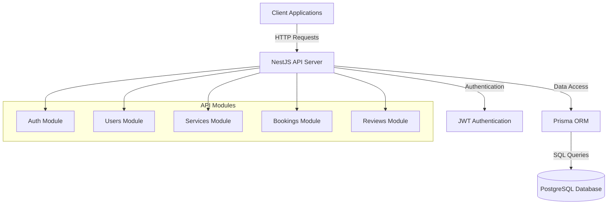
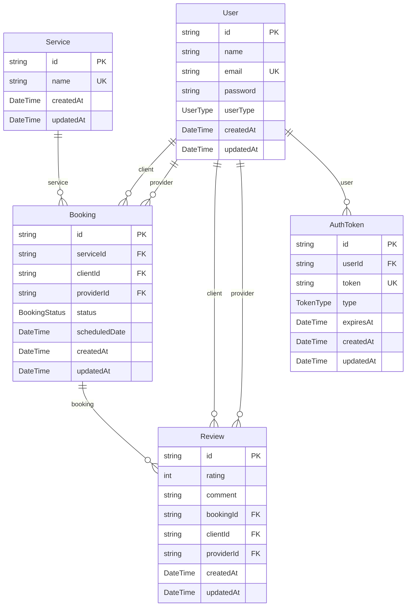
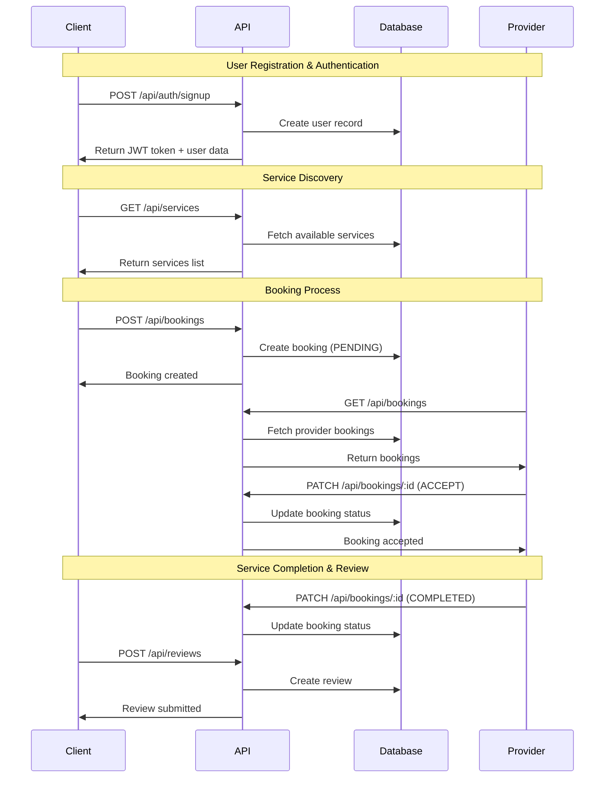

# 🚀 Help App API Documentation

## 📋 Project Overview

Help App is a comprehensive service-based platform that connects clients with service providers for on-demand tasks such as plumbing, cleaning, electrical work, and more. The backend API is built with NestJS, Prisma ORM, and PostgreSQL to provide robust, scalable, and secure services.

### 🏗 Architecture Overview



### 🎯 Core Features

- **User Management**: Client and provider registration/authentication
- **Service Catalog**: Manage service types (plumbing, cleaning, electrical)
- **Booking System**: Create, manage, and track service bookings
- **Review System**: Rate and review completed services
- **JWT Authentication**: Secure API access with role-based permissions

## 🗄 Database Schema



### 📊 User Flow Diagram



## 🔐 Authentication System

### JWT Token Structure
```json
{
  "sub": "user_id",
  "email": "user@example.com",
  "userType": "CLIENT|PROVIDER",
  "iat": 1671234567,
  "exp": 1671320967
}
```

### User Types
- **CLIENT**: Can book services and leave reviews
- **PROVIDER**: Can accept bookings and receive reviews
- **ADMIN**: Can manage services (future enhancement)

## 📚 API Endpoints Reference

### 🏠 Health Check

#### GET /
**Description**: Health check endpoint with welcome message

**Response**:
```json
"Welcome to Help App Backend Service! 🚀"
```

**Status Codes**:
- `200`: Service is healthy

---

### 🔑 Authentication Endpoints

#### POST /api/auth/signup
**Description**: Register a new user (client or provider)

**Request Body**:
```json
{
  "name": "John Doe",
  "email": "john@example.com",
  "password": "password123",
  "userType": "CLIENT"
}
```

**Success Response** (201):
```json
{
  "access_token": "eyJhbGciOiJIUzI1NiIsInR5cCI6IkpXVCJ9...",
  "user": {
    "id": "clxyz123abc",
    "email": "john@example.com",
    "name": "John Doe",
    "userType": "CLIENT"
  }
}
```

**Error Responses**:
- `400`: Invalid request data
- `409`: User with email already exists
- `500`: Internal server error

#### POST /api/auth/login
**Description**: Authenticate user and return JWT token

**Request Body**:
```json
{
  "email": "john@example.com",
  "password": "password123"
}
```

**Success Response** (200):
```json
{
  "access_token": "eyJhbGciOiJIUzI1NiIsInR5cCI6IkpXVCJ9...",
  "user": {
    "id": "clxyz123abc",
    "email": "john@example.com",
    "name": "John Doe",
    "userType": "CLIENT"
  }
}
```

**Error Responses**:
- `401`: Invalid credentials
- `500`: Internal server error

#### GET /api/auth/me
**Description**: Get current user profile (Protected)

**Headers**:
```
Authorization: Bearer <jwt_token>
```

**Success Response** (200):
```json
{
  "id": "clxyz123abc",
  "email": "john@example.com",
  "name": "John Doe",
  "userType": "CLIENT",
  "createdAt": "2024-06-18T00:00:00.000Z",
  "updatedAt": "2024-06-18T00:00:00.000Z"
}
```

**Error Responses**:
- `401`: Unauthorized (invalid or missing token)

---

### 🛠 Services Endpoints

#### GET /api/services
**Description**: List all available services (Public)

**Success Response** (200):
```json
[
  {
    "id": "service_plumbing_001",
    "name": "Plumbing",
    "createdAt": "2024-06-18T00:00:00.000Z",
    "updatedAt": "2024-06-18T00:00:00.000Z"
  },
  {
    "id": "service_cleaning_002",
    "name": "Cleaning",
    "createdAt": "2024-06-18T00:00:00.000Z",
    "updatedAt": "2024-06-18T00:00:00.000Z"
  },
  {
    "id": "service_electrical_003",
    "name": "Electrical Work",
    "createdAt": "2024-06-18T00:00:00.000Z",
    "updatedAt": "2024-06-18T00:00:00.000Z"
  }
]
```

#### POST /api/services
**Description**: Create a new service type (Admin only, Protected)

**Headers**:
```
Authorization: Bearer <jwt_token>
```

**Request Body**:
```json
{
  "name": "Garden Maintenance"
}
```

**Success Response** (201):
```json
{
  "id": "service_garden_004",
  "name": "Garden Maintenance",
  "createdAt": "2024-06-18T00:00:00.000Z",
  "updatedAt": "2024-06-18T00:00:00.000Z"
}
```

**Error Responses**:
- `401`: Unauthorized
- `403`: Forbidden (insufficient permissions)
- `409`: Service name already exists

---

### 📅 Bookings Endpoints

#### POST /api/bookings
**Description**: Create a new booking (Client only, Protected)

**Headers**:
```
Authorization: Bearer <jwt_token>
```

**Request Body**:
```json
{
  "serviceId": "service_plumbing_001",
  "scheduledDate": "2024-07-01T10:00:00Z"
}
```

**Success Response** (201):
```json
{
  "id": "booking_abc123",
  "serviceId": "service_plumbing_001",
  "clientId": "client_xyz789",
  "providerId": null,
  "status": "PENDING",
  "scheduledDate": "2024-07-01T10:00:00Z",
  "createdAt": "2024-06-18T00:00:00.000Z",
  "updatedAt": "2024-06-18T00:00:00.000Z",
  "service": {
    "id": "service_plumbing_001",
    "name": "Plumbing"
  }
}
```

#### GET /api/bookings
**Description**: Get user's bookings (Protected)

**Headers**:
```
Authorization: Bearer <jwt_token>
```

**Query Parameters**:
- `status` (optional): Filter by booking status
- `page` (optional): Page number for pagination
- `limit` (optional): Number of items per page

**Success Response** (200):
```json
[
  {
    "id": "booking_abc123",
    "serviceId": "service_plumbing_001",
    "clientId": "client_xyz789",
    "providerId": "provider_def456",
    "status": "ACCEPTED",
    "scheduledDate": "2024-07-01T10:00:00Z",
    "createdAt": "2024-06-18T00:00:00.000Z",
    "updatedAt": "2024-06-18T01:00:00.000Z",
    "service": {
      "id": "service_plumbing_001",
      "name": "Plumbing"
    },
    "client": {
      "id": "client_xyz789",
      "name": "John Doe",
      "email": "john@example.com"
    },
    "provider": {
      "id": "provider_def456",
      "name": "Jane Smith",
      "email": "jane@example.com"
    }
  }
]
```

#### PATCH /api/bookings/:id
**Description**: Update booking status (Provider only, Protected)

**Headers**:
```
Authorization: Bearer <jwt_token>
```

**URL Parameters**:
- `id`: Booking ID

**Request Body**:
```json
{
  "status": "ACCEPTED"
}
```

**Valid Status Transitions**:
- `PENDING` → `ACCEPTED`, `REJECTED`
- `ACCEPTED` → `COMPLETED`, `CANCELLED`

**Success Response** (200):
```json
{
  "id": "booking_abc123",
  "status": "ACCEPTED",
  "updatedAt": "2024-06-18T01:00:00.000Z"
}
```

**Error Responses**:
- `403`: Forbidden (not assigned provider)
- `404`: Booking not found
- `409`: Invalid status transition

---

### ⭐ Reviews Endpoints

#### POST /api/reviews
**Description**: Create a review for completed service (Client only, Protected)

**Headers**:
```
Authorization: Bearer <jwt_token>
```

**Request Body**:
```json
{
  "bookingId": "booking_abc123",
  "rating": 5,
  "comment": "Excellent service! Very professional and timely."
}
```

**Success Response** (201):
```json
{
  "id": "review_ghi789",
  "rating": 5,
  "comment": "Excellent service! Very professional and timely.",
  "bookingId": "booking_abc123",
  "clientId": "client_xyz789",
  "providerId": "provider_def456",
  "createdAt": "2024-06-18T02:00:00.000Z",
  "updatedAt": "2024-06-18T02:00:00.000Z"
}
```

**Validation Rules**:
- Rating must be between 1-5
- Booking must be in COMPLETED status
- Only booking client can create review
- One review per booking

---

## 🚨 Error Responses

### Standard Error Format
```json
{
  "statusCode": 400,
  "message": "Validation failed",
  "timestamp": "2024-06-18T00:00:00.000Z",
  "path": "/api/endpoint"
}
```

### Common HTTP Status Codes
- `200`: Success
- `201`: Created
- `400`: Bad Request (validation errors)
- `401`: Unauthorized (missing/invalid token)
- `403`: Forbidden (insufficient permissions)
- `404`: Not Found
- `409`: Conflict (duplicate resource)
- `500`: Internal Server Error

### Validation Error Example
```json
{
  "statusCode": 400,
  "message": [
    "name should not be empty",
    "email must be a valid email",
    "password must be longer than or equal to 8 characters"
  ],
  "error": "Bad Request"
}
```

## 🔧 Environment Configuration

### Required Environment Variables
```env
# Database Configuration
DATABASE_URL="prisma+postgres://accelerate.prisma-data.net/?api_key=..."

# JWT Configuration
JWT_SECRET="your-super-secret-jwt-key-change-in-production"
JWT_EXPIRES_IN="24h"

# Server Configuration
PORT=3000
NODE_ENV=development
```

### Development Setup
```bash
# Install dependencies
npm install

# Setup environment
cp .env.example .env
# Edit .env with your configuration

# Run database migrations
npx prisma migrate dev

# Seed database
npx prisma db seed

# Start development server
npm run start:dev
```

## 🧪 Testing

### Manual API Testing
```bash
# Test health endpoint
curl http://localhost:3000

# Test user signup
curl -X POST http://localhost:3000/api/auth/signup \
  -H "Content-Type: application/json" \
  -d '{"name":"Test User","email":"test@example.com","password":"password123","userType":"CLIENT"}'

# Test protected endpoint (replace TOKEN)
curl -X GET http://localhost:3000/api/auth/me \
  -H "Authorization: Bearer YOUR_JWT_TOKEN"
```

### Automated Testing Scripts
```bash
# Run comprehensive endpoint tests
./test-endpoints.sh

# Run database tests
./test-db.sh
```

## 📖 API Documentation Access

- **Swagger UI**: http://localhost:3000/api
- **API Base URL**: http://localhost:3000
- **Prisma Studio**: http://localhost:5555

## 🚀 Deployment

### Production Considerations
1. **Environment Variables**: Update JWT_SECRET with cryptographically secure key
2. **Database**: Configure production PostgreSQL instance
3. **HTTPS**: Enable SSL/TLS certificates
4. **Rate Limiting**: Implement API rate limiting
5. **Monitoring**: Set up application monitoring and logging

### Docker Deployment
```dockerfile
FROM node:18-alpine
WORKDIR /app
COPY package*.json ./
RUN npm ci --only=production
COPY . .
RUN npx prisma generate
RUN npm run build
EXPOSE 3000
CMD ["npm", "run", "start:prod"]
```

## 🔄 API Versioning

Current API version: **v1**

All endpoints are prefixed with `/api` for the current version. Future versions will be available at `/api/v2`, etc.

## 📞 Support

For API support and documentation updates, please contact the development team or create an issue in the project repository.

---

**Last Updated**: June 18, 2024  
**API Version**: 1.0.0  
**Documentation Version**: 1.0.0 